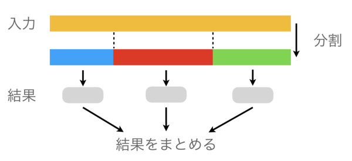
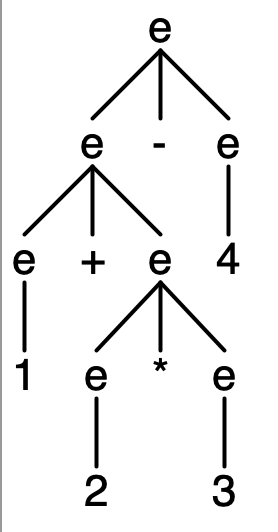

## 文字列データの解析

文字列データは，人間が読みやすく，かつ，計算機が処理しやすいよう設計されていて，多くのところで応用されていることは言うまでもありません．それゆえ，文字列データを解析するツールもたくさん作られていて，高速化もなされています．文字列データは大きく
2 種類，

  1. XML や JSON など標準化されている形式 
  2. サーバのログなど，標準化されていない，プログラムそれぞれの特性に合わせた形式 

があります．

標準化されている形式のデータを解析するツールは，そのデータ形式に特化したプログラムを書けばできます．標準化されていないデータに関しては，もちろんいちいちプログラムを書けばできるが，それでは非効率的です．実際には，プログラマが解析ツールを手で書くのではなく，そのデータの従う文法だけ書いて，解析ツールはその文法から機械的に生成されます．一般的に，解析ツールを「パーサ（構文解析器）」，そしてパーサを生成するプログラムを「パーサジェネレータ」と呼びます．

## パーサの高速化・並列化

そして，パーサの高速化は，アルゴリズムの改良は無論のこと，入力データを適切に分割して，並列に解析するようにすることが今の計算機に合わせたやり方と言えるでしょう．

入力データを行に分けて並列に解析することや，複数のファイルに分けて解析することができます．ただし，このでは特に 1 つの大きなファイル
(例えばウィキペディアの JSON 形式のダンプファイルは 1 つで 500 GB ほどあります) の解析について考えます．

並列に入力ファイルを解析する場合は，入力を複数のチャンクに分割して，その各チャンクについて構文解析を行います．そして，需要に応じて結果をまとめるなり，その先の処理をするなりします．

仮に構文解析の並列化が完全にできたとしたら，入力を3つの部分に分割すれば，（全体の）構文解析の速度が3倍になって，たくさんのプロセッサを使えば，その分解析時間が短くなります．もし500GBのファイルを逐次に解析するのに40分かかるとしたら，192分割すればたった10秒ほどで終わります．

## 並列構文解析の難しさ

プログラマが手で書くパーサ，つまり標準化されている形式向けのパーサは，あらかじめそのデータの構造がわかっているので，並列化は比較的に簡単です．しかし，後者の場合はそう簡単ではありません．

パーサジェネレータはある形式文法のクラス（そうでないものもありますが基本的に文脈自由文法のサブクラスと考えて問題ありません）に属す文法しか認識しません．プログラマが文法だけ記述するとありましたが，当然使うパーサジェネレータのサポートする形式文法の範囲で書く必要があります．ある形式文法に対して，その形式文法のための解析法が存在して，パーサジェネレータは，解析法に従ってパーサを生成しているだけです．そして，肝心なのは，ほとんどの解析法は，入力文字列を最初から順に読まなければ解析できません（参考までに，広く使われているものとして，LL法，LR法などがあります）．

下の図は，四則演算の文法を使ってパーサを生成して，そのパーサに入力として`1+2*3-4`を与えた時に生成された構文木です．

田浦研究室では，入力データを複数の部分に分割して，同時に構文解析を行うパーサを生成するパーサジェネレータの研究をしています．

