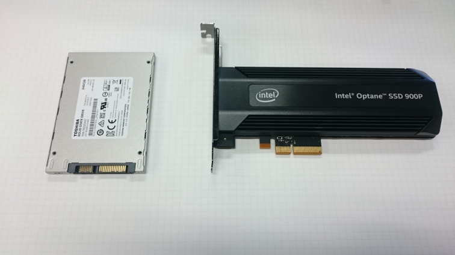

# 次世代SSDによるVMMを用いたメモリ空間の拡張

## 次世代SSD

HDDやNAND SSDに代わり，またそれ以上の使い方も模索されている新たなメモリ技術にNon-Volatile Memory
(NVM)と呼ばれるものがあります． その実現方法は，MRAMやSTT-RAMなど様々な方法が実験室レベルで提案されています． その中でもIntel
+Micronが発表した3D-XPointは，すでに実用化されOptane SSDという名前でAmazonでも購入できるようになっています．

  * 

上の写真の右側がOptane SSD，左がよくある通常のNAND SSDです．
端子部分を見るとおわかりかと思いますが，この2つのSSDでは接続規格が異なっています． 左のNAND
SSDはSATAインタフェースによって接続されるのに対して，右のOptaneはNVMeと呼ばれるPCI
Expressを用いた規格を採用しており，小さいレイテンシと高いバンド幅が期待されています．

このような接続規格の違いは，それぞれのメモリ記憶素子技術に起因しています．
例えば8バイトの変数をDRAM（メインメモリ）に書き込む際には，その8バイト，あるいはそれを含むキャッシュラインを取ってきて書き込めば事足ります． NAND
SSDの場合はブロックという単位でしか書き込みを行うことができないためたとえ8バイトのみの変更であったとしても，それを含む全ブロックをflashした上で新たに書き込む必要があります．
またこの特徴のため，NAND SSDにはファームウェアが内蔵されており，ブロックのリマッピングを行っています． これが長いレイテンシに繋がっています．
一方でNVMは，byte-
addressabilityを持ち，DRAMのようにバイト単位で読み書きをすることができ，ファームウェアもシンプルな形で済むのでアクセスレイテンシが小さくなります．

各素子自体のレイテンシの違いも手伝って，実際に100倍以上のアクセスレイテンシの隔たりが存在します．

このような低レイテンシ，byte-
addressableなデバイスの登場は，単に速いストレージというだけに収まらず，既存のシステムレベルのソフトウェアに変化を強いています．

## VMMを用いたメモリ拡張

Optane SSDに代表される次世代SSDの応用に一つに仮想マシン（VM）を用いたメモリ拡張があります．

通常アプリケーションはメインメモリの範囲内でプログラムを実行します．
メインメモリ以上の実メモリを使おうとする場合，仮想記憶によりスワップデバイスが選択されます．
往々にしてスワップの使用は性能を大幅に低下させる（と思われてきた）ので，現在ではこれを積極的に使おうとする働きはあまりありません．
しかし，スワップデバイスが次世代SSDに置き換わり，メインメモリに少し劣るだけの性能を手に入れた場合，事情は異なってくるでしょう．
このとき，スワップの使用はビット当たりの値段が経済的に高いDRAMの良い代替となります．

しかしながら，一部のアプリケーションにはメモリの使用量を意識して，スワップデバイスを利用しようとしないものが存在します．
そのようなアプリケーションであっても互換性を保ちながら（すわなちソースコードを改変する必要がないということ）動かす方法として仮想マシンを用いたものが挙げられています．
スワップデバイスをホストOSのみに露出し，ゲストOSとその内部で動くアプリケーションにはあたかも巨大なメモリが存在するように見せる技術です．

主要なアプリケーションとしてはCDNやデータウェアハウス，ビッグデータのインメモリ解析などが挙げられます．
また，環境はクラウド環境でプロバイダ側が採用することが想定されています． このことは一クラウドユーザもこのメモリ拡張技術と無関係で無いことを意味しています．
なぜならば，提供されたインスタンスがこの技術上で動いている可能性が多いにあるからです．

## Mission: 高速化

さて，先程も述べましたが，新たなデバイスの登場に伴いシステムレベルアプリケーションもその設計の変更を余儀なくされています．
私の研究では，特にレイテンシをいかにして縮めるかということに注力し，研究を行っています．
具体的には，上記環境においてゲストOS内のアプリケーションがメインメモリ（だと思っているもの）にアクセスした場合，実際にはSSDの方へ書き出されており，単なるメモリアクセスがスワップインを駆動する可能性があります．
これはゲストOS内アプリケーションには不測の事態となるので，このような場合でもレイテンシを一定以下にする（ことを保証する）ことがアプリケーションのQuality
of Serviceの維持につながるのです．

