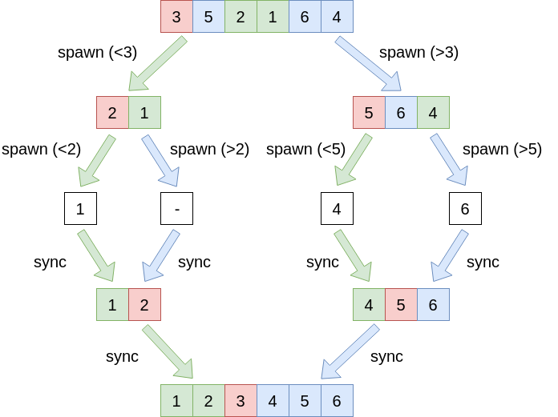
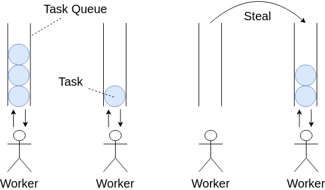

## タスク並列モデル

田浦研究室では、並列プログラミングモデルの1つである **タスク並列モデル** について研究しています。

タスク並列は、タスクの依存関係を元に並列実行をしていく並列プログラミングモデルであり、タスク間の依存関係を指定するだけで並列実行が可能になります。

タスク並列モデルを使うと、例えばクイックソートを簡単に並列化することができます。 以下がタスク並列を用いて書かれたクイックソートの疑似コードです。

```c++
quicksort(data) {
  if (data.length <= 1) {
    return data;
  } else {
    p       = select_pivot(data);
    smaller = spawn quicksort([data < p]);
    larger  = spawn quicksort([data > p]);
    sync;
    return (smaller ++ p ++ larger);
  }
}
```

`spawn`はタスクを生成するキーワード、`sync`は生成したタスクの実行の終了を待つキーワードです。
まずピボット`p`を`data`から選び、`data`を`p`より小さい要素、大きい要素に分け、それぞれのソートを実行します。
それぞれのソートは並列に実行することができるので、`spawn`を付けてタスクとして生成し、`sync`でそれらのタスクの終了を待ちます。



タスクの依存関係をグラフで表すと上の図のようになります。
図の矢印は`spawn`、あるいは`sync`の依存関係を表しており、あるタスクは自身に向かう矢印の前のタスクがすべて完了した時点で実行可能になります。
このようなグラフはDirected Acyclic Graph (DAG)としばしば呼ばれます。

このように問題を再帰的に小さく分割していくアプローチは **分割統治法**
と呼ばれ、このような分割統治法を用いたプログラムでは`spawn`、`sync`のような記述を単純に追加するだけで並列実行が可能になるケースがよくあります。

タスク並列の利点は、このように簡潔に並列性を記述できる点にあります。

## タスク並列処理系（スケジューラ）

先程見たように、タスク並列モデルでは簡潔に並列処理を記述することができます。
では、その生成されたタスクは一体どのように物理的なコアに配置され、実行されるのでしょうか。 その各タスクのスケジューリングを担っているのが
**タスク並列処理系** です。

タスク並列処理系は、各コアでの仕事量が均等になるように **負荷分散** を行います。
先ほどクイックソートのDAGの例ではバランスの良いDAGになっていますが、ピボットの選び方によってはバランスの悪いDAGが生じることがあります。
そのように不規則なタスク生成を伴うような場合でも、適切な負荷分散を行う必要があります。

### Work Stealing

現在広く用いられている代表的な負荷分散手法として、 **Work Stealing** があります。

Work Stealingは、負荷分散をタスクの実行中に、つまり動的に行う手法です。

実際にタスクを実行する主体をWorkerと呼びます。 ここではWorker = CPUのコア、と考えてもらって構いません。



それぞれのWorkerは固有のタスクキューを持ち、基本的にはそのタスクキューからタスクを出し入れする形でタスクを実行していきます。
あるWorkerがタスクキューにタスクがなくなった場合、別のWorkerをランダムに選択し、そのWorkerのタスクキューからタスクを盗む、つまりstealすることを行います。

もちろん、stealしに行ったタスクキューにもタスクがなく、stealが失敗することもあります。 その場合は、タスクが見つかるまでstealを繰り返します。

Work Stealingのすごいところは、不規則にタスクが生成されるような場合でも、上手く負荷分散を行ってくれることにあります。

### Work Stealingの問題点

Work Stealingでは、メモリの **局所性** を損なうケースがあります。

先程のクイックソートの例を考えると分かるように、タスクのグラフにおいて近いタスクは近いデータを触る傾向にあります。 これをここでは局所性と呼んでいます。
しかし、Work Stealingの「ランダムにstealする相手を選択する」という性質から、近いタスクを近いWorkerが実行してくれるとは限りません。
このような理由から、Work Stealingでは局所性を損ない性能が悪化してしまうケースが往々にしてあります。

## 局所性に配慮した負荷分散手法

局所性に配慮した負荷分散手法を考えることは、田浦研究室の研究テーマの1つです。

現時点で、タスク並列処理系は1ノード内の実行にとどまった実装がほとんどで、複数ノード、例えばスパコンなどのシステムで動かすのは難しいとされています。
局所性に配慮した負荷分散を行うことができれば、1ノード内の性能が向上することはもちろんのこと、ゆくゆくは複数ノードできちんと性能が出せるタスク並列処理系を作ることにつながっていきます。

しかし、局所性に配慮したタスク並列処理系を作る上で難しいのは、

  1. 局所性の良いようにタスク配置を決定すること 
  2. 実行できるタスクがあるとき、暇なWorkerが生じないこと 

この2つが両立しにくい、ということです。

田浦研究室では、タスク並列処理系の[MassiveThreads](https://github.com/massivethreads/massivethreads)を開発し、それを元にスケジューリング手法の改善を試みています。

