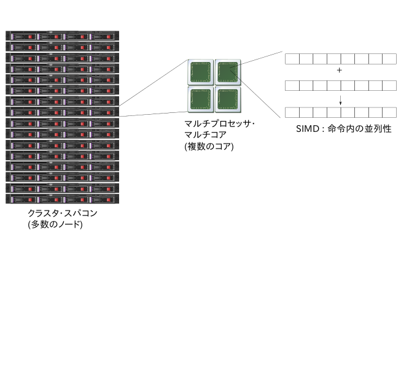
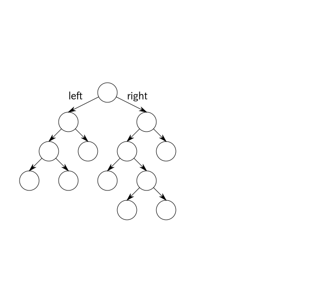

# (主に) 新4年生向け: 研究室のテーマ, 最近の取り組みの紹介

## 研究室の中心的テーマ

田浦研究室の中心的分野は, 高性能な計算環境を容易に(プログラマとして, あるいはエンドユザーとして)利用でき, なおかつ高性能に実行できるような,
基盤ソフトウェアです.

そのために, プログラミング言語の設計, その処理系, コンパイラ, 実行時システム, オペレーティングシステムレベルの基盤技術の設計や実装,
ファイルシステムやデータベースなどのデータ格納・処理基盤の設計や実装, プログラミングなしで並列処理を行うエンドユーザ向けツールの設計や実装,
新しい並列アルゴリズムの研究, などを行なっています.

多くのテーマは「高性能な計算環境を」「簡単に」使えるようにするという点で共通しています. このゴールに興味・共感を覚え,
自分でそこを変えようという意欲のある人を歓迎します. もちろん宗教ではありませんので, 何に共感するかは人それぞれです. このゴールに共感を覚えなくても,
基盤ソフトウェア(言語やOS)に興味がある人にはアドバイスが可能です. 新しい並列アルゴリズムを作る,
並列処理系を実応用に適用することに興味がある人も歓迎です.

以下ではそのようなテーマを重要だと感じてもらうための分野紹介, そして最近実際に手がけている・またはつい最近まで手がけていた個別の研究を紹介します.

## 並列処理入門

### 高性能な計算環境とか, 並列計算環境ってなにさ?

今日の「高性能な」計算機というのはどのようなものでしょうか? スーパーコンピュータ(「スパコン」)という言葉は聞いたことがあると思います.
それがどんなものかについてどんなイメージを持っているでしょうか?

何か, 自分たちが普段使っているIntelのCPUとはまるで違う, 特殊なCPUが搭載されていて,
特殊なプログラミング言語で書かれたプログラムを20GHzの動作周波数で実行しているというイメージでしょうか?

実を言うと, 「スパコン」に搭載されているCPUも, その辺のラップトップやデスクトップに搭載されているものと大差ありません.
IntelのCPUであることがほとんどですし, そうでない場合でもIntelのCPUより, 周波数が速いとかいうわけではありません.
むしろデスクトップ搭載のものよりも, 周波数は低めと言う事のほうが多いくらいです.

ではどこが「スーパー」で, 何が高性能な理由なのかというと, 「並列性」です. 今のスパコンは, 信じらないくらいの数のプロセッサ(以下,
コア)を搭載しています. 例えば, 2013年12月現在, (ある基準となるベンチマークで)世界最速の計算機は, 中国の天河2号というマシンですが,
合計で312万個のコアを搭載しています. 1箱(ノード)の中に, 195個のコア, それが16000ノード, ネットワークで結合しています.
195個のコアはIntelのプロセッサですが, そのうちの多くの部分はXeon Phiという, 周波数が1.0GHzくらいで,
かつアーキテクチャとしても数世代前の, 単独では遅いコアを使っています. 他のマシンも似たようなもので, 端的に言えば,
普通もしくは遅いコアを多数搭載したノードを多数結合しているのが現在のスーパーコンピュータです.

 天河2号(source: www.top500.org)

 京(source: www.aics.riken.jp)

ところで, 割と普通の計算機ノードをネットワークで結合した環境というのは, 「スパコン」と呼ばれなくとも使われるものになりました.
小規模な研究室のLAN環境ですら, 大雑把に言えばそういうものです. それを少し大規模化したものは通常「クラスタ」と呼ばれ,
大量の計算をしたい人が構築・利用しています. クラスタは, 大規模なトラフィックを処理しなくてはいけないウェブサービス(Google,
Yahooなどの検索エンジン, Amazonなどのeコマースサイト, ゲームサイト, 電子メールサービスなど)でも, 必ずと言っていいほど使われています.
また, 今はそのようなクラスタを必要なときに必要な時間だけ使える基盤サービス(クラウド環境; Amazon EC2など)が普及し,
クラスタ環境はますます「その辺にある」環境になっています. つまり, 少し大規模な何か(計算であれ, サービスの構築であれ)をしようと思うと,
それは並列計算環境をプログラミングする必要がありますし, それができればすぐにでも実行できるのです.

一つの箱(ノード)の中に目を転じても似た様な状況です. 195個のコアを積んだノードというのは十分「特殊」ではありますが, 現在でもラップトップに4-8,
少し大きなサーバであれば数十のコアが搭載されています. そのようなマシンの性能を活かそうと思うと,
ノードの中でも並列処理をおこなうソフトウェアを書く必要があります. 少し以前までは, 並列処理を行うソフトウェアを書かなくても,
CPUの世代がひとつあがれば, プロセッサが勝手にソフトウェアを高速化してくれました.
「各時点で最高速」を目指せば並列ソフトウェアが必要なのはいつの時代も一緒ですが, そうではなく,
現在並列化されていないソフトがあるけどそれをどう2倍高速化するか, という人にとっては, 昔は並列化をする(それに時間を費やす)変わりに,
「次の世代のプロセッサを待つ」という方法(?)が, 経済的には意味をなしていました.

少し前まで, 逐次的な処理を行うソフトウェアが代々, プロセッサの力で, 向上していた理由は以下に集約されます.

プロセスルールが微細化することにより,

  1. 面積あたりの消費電力を一定に保ったまま動作周波数を向上させる(Dennardスケーリング)ことができた. 
  2. 面積あたりのトランジスタ数が増加し, 増加したトランジスタをアーキテクチャ上の発明につなげ, 一クロックあたりの実行命令数を向上させることができた. 

しかし, アーキテクチャ上の発明で, 使用した面積に比例した性能向上をいつまでも得続けることは難しく, 費用対効果はどうしても悪くなっていきます. また,
(1) についても, 微細化が進むにつれ, 近年ではこのスケーリングは破綻しており, 世代が変わっても動作周波数はあがっていません.

そうであればということで, 増えた面積の利用法として, より単純に複数のプロセッサコアを搭載して, 並列性を持つソフトウェアの性能向上を目指しているのが,
近年のマルチコアプロセッサです. またもっと極端に, アーキテクチャ上の工夫を何世代か, "undo"して, 以前の単純なコアを多数搭載し,
並列性がふんだんな一部のソフトウェアの性能向上を目指す, という方向性も試みられています(GPUやIntelのXeon Phi).

 Intel Xeon Phi
(source: www.intel.co.jp)

このようなプロセッサでは, 通常の逐次処理(C言語で普通に書いたプログラムは基本的に全て逐次処理です. 複数のスレッドやプロセス,
またはOpenMPなどの並列処理言語を使わずに書いたものはそうなります)を書いている限り, どんなに頑張っても, 1コア分の性能しか出ないことになります.

さらに, 1つのコアの中でも似た様な状況があります. 近年のプロセッサコアは, SIMD命令という命令を利用してピーク性能を稼いでいます.
SIMD命令というのは, 一つの命令で複数のデータを処理するために明示的に用意された命令です. これも並列処理の一形態です.
独立したスレッドをプログラマに書かせるのではなく, より細かいレベル(命令)で並列処理を行います. これは, プロセッサ設計という観点からすると,
プロセッサを複雑にせずに並列度を稼ぐ, てっとり早い方法です. 現在のプロセッサは, 一命令で 2-16 くらいのデータを処理する命令が用意されており,
逆にいうとこれを有効活用しなければ, プロセッサの最大性能の, 1/2〜1/16 の性能しか出ない, ということがその時点で決まるという事です.

スパコンやクラスタに見られる複数ノードを結合する並列処理, 一つのノード内の複数プロセッサコアによる並列処理, ひとつのコア内のSIMD命令による並列処理,
すべてに共通しているのは, 「並列処理がソフトウェアの仕事になった」ということです.

### 並列計算のためのプログラミング言語ってなにさ?

さて, 「並列処理がソフトウェアの仕事になった」ところで, ではそのソフトウェアをどうやって書くのでしょう, という話になります.

理想的な世界は, 「ソフト=言語処理系」であり, プログラマは相変わらず逐次的な処理をプログラムとして書き,
そこから並列性を取り出す処理は全部言語処理系(コンパイラ)がやってくれるという世界です.

逆に最も面倒な世界は「ソフト=アプリケーション」ということで, 並列処理にまつわる仕事が全部, 処理系ではなく,
アプリケーションを書くプログラマ(人間)の肩にそのままのっかってくるという世界です.

現状がどうなっているかというと, 使いたい並列度の階層(SIMD, 箱の中の複数のコア, 複数の箱)や, 応用によってもある程度事情が異なりますが,
上記で述べた「最も面倒な世界」に近い, と言っておきます.

我々の研究テーマの多くの部分はこの, 「最も面倒な世界」に近い現状を変えて, プログラマが容易に並列処理を記述でき,
なおかつそれを実際の並列計算機で高速時に実行できる仕組みを作ることです.

### どこが難しいのか?

それを達成することのどこが難しいのかを説明するため, 並列処理の基本を説明します.

並列処理をソフトウェアで行う場合に, 言語処理系であれプログラマであれ, 誰かがやるべき仕事を大雑把に述べると以下の3つになります.

  * 並列性の抽出: 処理の中で, 並列に実行可能な部分を認識する 
  * 負荷分散: それらの処理のうちのどれをどのプロセッサが担当するかを決める 
  * 協調動作: プロセッサ間で必要な協調動作(値の受け渡しのための通信や同期) 

並列処理を行うというと, 最初の「並列性の抽出」をイメージすると思いますが実際には残り2つも同じくらい重要, かつ面倒です.
並列計算を「容易に」するというのは, 基本的にはそれらの処理をなるべく, プログラマの肩に載せるのではなく, 言語処理系がやってあげようということです.

すべてを処理系がやってあげることができれば, プログラマからの見た目は逐次処理その物です. 極めて幸せな世界です.

#### 並列性の抽出

しかしそれを, 一般的なプログラムに対して自動的に行うことは非常に困難です. 負荷分散の話を脇に置いといて,
並列化の問題だけを取り出しても自動化は困難です. たとえば,

    
    
      void add(tree * t) {
        t->value++;
        if (t->left) add(t->left);
        if (t->right) add(t->right);
      }

というプログラムを考えます. これは, 木構造をたどりながら各ノードの, valueという要素を +1 するというプログラムに見えます. ここで,
上記のaddを並列に実行して良いかどうか, 言語処理系に判定できるでしょうか?

「並列に実行して良い」というのはつまり, 逐次的に実行した場合と結果が変わらないという意味ですが,
その一つの十分条件として「同じデータを触らない」計算は並列にやって良い, というものがあります. 同じデータを触らないのであれば,
お互いの計算が相手に影響を及ぼさない, ということですから, どんな順番でやろうと結果は変わりません. このプログラムにおいては, 2つの再帰呼び出し
add(t->left) とadd(t->right)が触るデータに共通部分がなければよいということになります.

しかしこの判定が困難であることは容易に想像がつきます. あるプログラムがどのメモリを触るかというのは, 配列の添字, 用いている配列やポインタ,
などに応じて変わるわけで, それらに重なりがないかを判定する高精度なアルゴリズムを作るのは困難です(正確に判定するのは, 決定不能と容易にわかります).
実際この例でも, t->leftとt->rightが同じ領域を指していないという保証はありません. t->leftとt->rightが別であっても,
t->left->right と
t->right->rightが同じでないという保証はありません(実際上記が「木構造」であるという証拠はどこにもありません).

なので一般的なプログラムを自動的に並列化するというアプローチはすぐに限界にぶち当たります. 一方で,
プログラマから見れば理想的な世界であることには違いないので, そのようなことが可能なプログラムのサブセットや, 特定目的の言語というのも研究されています.

  * Cプログラムのうち, 比較的規則的なループに限定したもの(アフィンループネスト) 
  * 大量データ処理などの特定応用に対する専用の言語(MapReduceや, データベースの問い合わせなど) 

後者のような処理に対してはそもそもCのような低級な言語で書きたいわけでもないので, ある特定応用向けの言語を設計し,
それで書けば後は処理系がやってくれるというのは, 特に魅力的なアプローチです.

この方向の話は一旦切り上げて, 一般的なプログラムの並列化に話を戻します. 言語処理系が自動的にという話を諦めれば, そこはプログラマの肩に,
ということになり, 世の中ではこの方式が主流です.

大きな後退と思うかも知れませんし事実そうなのかもしれませんが, 実際には, 並列度の抽出自体は「自明」と言ってよい問題も多いです.
大量のデータから特定の条件を満たすデータを検索する, それらを集計するなどの, データの書き換えを伴わない処理, 画像処理など多くの画素に対する処理,
自然の法則をシミュレートする計算などでは, 「並列に行える処理」自体は自明に存在しています. クイックソートに現れる2つの再帰呼び出しを並列に行なって良い,
ということは人間にはすぐにわかります. 何故ならば両者は配列の別々の部分を更新しているから. その, 人間には自明な事を,
言語処理系で自動的に判定するのが難しいという自体に遭遇しています.

#### 負荷分散

並列化の次は負荷分散があります. プログラマが並列性を抽出してくれたら, それをプロセッサに振り分けるのに何も本質的な困難などない,
と思うかも知れませんがそうではありません. 以下を達成しなくてはなりません.

  * 負荷を均等にする 
  * 協調のための通信を最小限にする 

両者とも言われみれば当然のことでしょう. 負荷を均等に, というのは, 仕事を分担したはいいが,
一人の仕事が遅いせいで全体がその人に脚を引っ張られることがないようにする, ということです. いや, 負荷の均等なんて本質的には, 仕事の総量/プロセッサ数
の割り算だけではないか, と思うかも知れません. もちろんそれで済む場合もあります. 1000000回繰り返すループを100人で割る場合,
各繰り返しにかかる処理時間がほぼ一定なら, それでOKという場合も, 確かにあります. しかし, 繰り返し毎に処理時間がバラバラである,
そもそも並列処理を開始する時点で, 仕事がどれだけ生まれるかわからないような処理(例えば上記の木構造をたどる例では,
木をたどってみないことには木がどこまで奥深く続いているかがわからない)など, 単純な割り算ですまないケースがしばしばあります.

負荷分散の問題が解決できたとして, 次の問題は, プロセッサ間で処理を実際に分割するための通信を少なくすることです. 現実世界での喩え話をすると,
上司が部下に仕事を割り振ってやらせるのに, 下手をすると「部下に指示を出す(通信する)時間があったら,
自分でやってしまったほうが速い」という場合がしばしば発生します. 細かい仕事を一々部下にやらせると, そういうことになりがちで, 基本的には仕事は「一度に,
大粒で」与えるべきという事になります. もしこの「通信」が問題でないなら, 仕事はいくらでも細かく分割し,
細かく分割したものを乱数か何かでランダムなプロセッサにやらせれば, 確率的にはだいたい負荷は均等化され, 負荷分散はあまり問題になりません.
しかしそれではいくら並列化と負荷分散ができても, 通信ばかりに時間が取られ, 処理時間の短縮にはつながりません.

負荷を均等に, だが通信は少なく, と言う問題の難しさは, 詳細を省略してモデル化するならば, ある物体(仕事全体)を体積が同じ部分に分ける,
しかしその際, 切った断面の面積(通信)をなるべく小さくする, というような問題に例えることができます.

最後に, その分割自体に時間がかかっては本末転倒です. ◯◯さんにこれをやらせよう, という分担ぎめを一晩かけて行なって,
実際にはその処理自体は一日あれば終わる, というのは本末転倒です. そのため, 負荷分散自身を,
上司の指示を待たずに部下同士が自律的に行うような仕組みも必要になります.

#### 難しさのまとめ

まとめると,

  * ある計算にどのくらいの負荷が発生するかわからない 
  * 仕事を細かく分けてランダムにばらまけば負荷は均等になるが通信量が膨大になる 
  * 仕事を「大粒かつ均等に」わけるのは, それ自体に計算量がかかる 

などの問題があり, 効率の良い並列処理の難しさは理解してもらえたのではないかと思います.

実応用では, これらの問題に対してどこまでシビアに取り組まなくてはいけないか, という事自体, 応用毎に異なります. シビアに最適化せず,
割と大雑把に負荷分散をしても, 発生する通信量が(計算量に比べて)大したことはない, というケースもあります. そのような問題に対しては,
それを利用してプログラマの肩から余分な荷物を下ろしてあげるという発想が大切です.

#### 巨大データ解析システムの研究

現在TVなどでもしばしば, 「ビッグデータ」という言葉が聞かれるようになりました. 他の多くの流行り言葉同様, 「ビッグデータ」も,
技術的に何が新しいのと言われると明確にすることは難しいのですが,

  1. 様々な実世界データを取得し, ほぼ無尽蔵に蓄積できるようになったこと, 
  2. それを解析するための計算機の処理能力やアルゴリズムの向上が著しいこと, 

などから, それらのデータの活用が, 狭くは個々の会社の利益向上のため, 広くは世の中全体のために役に立つであろうという期待が込められた単語です.

巨大データの解析に並列処理が必須であることは言うまでもありません. しかし, 巨大データの解析では, シミュレーションに代表されるような,
いわゆる科学技術計算とことなり, より高水準なプログラミング, またはそもそもプログラミングとは言えない程度の記述で, 結果を得ることが求められます.

なぜかというと, その主な目的が, 新たな知見を, 「未知のデータ」から発見することにあるからと言えます. そこでは,
アルゴリズムや検索方法が正しいからと言って, 得たい情報が発見されるとは限らず, 全てはデータのみぞ知るという世界です. そこで,
処理をするプログラム自身が, ある検索をかけた結果を見ながらの試行錯誤の結果として作られることが多いです. そして,
一度行った検索をパラメータを変えて何度も繰り返し行うということは少なく, いわばプログラムは「使い捨て」に近いものです.

また, 一回の処理自体は, データに対する同一の処理の適用, 条件によるフィルタリング, グループ化, 集計などの,
比較的単純な処理の組み合わせで記述できることが多く, 汎用的なプログラミング言語を必ずしも必要としない場面が多いです. また, 読んで字のごとく,
データ処理が基本ですから, 汎用的なプログラミング言語で記述すると面倒なのは, データの読み出し, 並列処理のためのデータの分散, などの処理になります.

したがって, 通常の数値計算を中心とした並列処理とは, 少し違うところに力点をおいた処理系が必要です.

  * 超高水準: データに対する処理の適用, フィルタリング, グループ化, 集計などの処理を極めて容易に記述可能 
  * データの入出力など, 処理の本質に関わらない部分をほとんど意識させない 
  * 並列化や負荷分散についても同様 

いわば, データ処理に特化した「超高水準言語」が必要です.

## グループとしての方向性

並列処理に必要な仕事を処理系が効率良く自動化することには様々な困難があるため, 並列処理のソフトウェアを作る際は,
アプリケーション固有の知識を持ったプログラマが, 並列性の抽出, (通信量の少ない)負荷分散, それに基づいた協調まで, 全て行うことが多いのが現状です.

一方で, 並列性を抽出するレベル, または想定する応用領域に応じて, 一部を自動化する試みも広く研究されています. 大雑把に言って,
並列処理に対する様々なアプローチの違いは, 「どこまでをプログラマにやらせて」「何を処理系がやることにするか」の違いと言えます.

我々は, プログラマが, 並列計算機の細部に依存した低水準な仕事から解放されて, アルゴリズムのロジックに集中できるようにするのが重要, と考えています.
一方で, 性能を無視してすべてを「処理系が引き受ける」ことにするだけなら話は簡単ですが, 意味がありません. あくまで, 性能との両立がポイントです.
並列処理をやっている人で「性能」が重要だと考えない人はいません. が, 同時にプログラミングの容易さも重要です. どちらにどのくらい重きを置くかで,
思想的な違いも生まれます. もちろん, 思想の違いである学生を歓迎, ある学生をお呼びでないなどと思っているわけではないことを, 念のため断っておきます.

その上で,

  * 主に科学技術計算, 数値計算を対象とした並列プログラミング言語, その基盤に関する研究 
  * 巨大データ解析に特化した言語, その処理系に関する研究 
  * それら処理系の実応用や, 新しい並列アルゴリズム 

に注力しています.

## 最近の研究テーマ

以上のような背景説明のもと, 以下では, 最近の個別の研究テーマについて, 簡単に紹介します.

### MassiveThreads 軽量スレッドライブラリ

上で述べた並列処理に必要なステップのうち, 「負荷分散」を自動的にやってくれるライブラリです. プログラマは,
OSのスレッド生成のAPIと似た様なAPIを用いてスレッドを作りますが, 個々のスレッドを極めて軽量, 高速に生成・破棄することができます. また,
負荷分散を行うために全体を統括する「上司」のような存在はなく, コア間での負荷分散をコア同士が自律的に行います. その際,
なるべく大粒の仕事をコア間で移動させることにより, 負荷分散自身の通信量や, 仕事に移動によって2次的に発生する通信が少なくなるようにします.

この成果は, [MassiveThreads](research/massivethreads.md)というオープンソースのライブラリとして公開
(<https://github.com/massivethreads/massivethreads>) されています. CやC++言語から容易に使うことができます.
類似のシステムとして, OpenMPのtask構文, IntelのThreading Building Block, Cilkplusなどがありますが,
これまでいずれのシステムとも同等か, 多くの場合それらを上回る性能を出している上, ライブラリとして提供されているために,
他のシステムへ組み込むことも可能な柔軟性を持っています. そのため,
米国のスパコンベンダCRAYが開発している並列プログラミング言語Chapelの実行時システムの一部としても採用されています.

より最近の展開としては,

  * 負荷分散方式の拡張フレームワーク 
  * 通信量(キャッシュミス)を削減する負荷分散方式 
  * プロファイラ, 可視化 
  * 科学技術計算への応用 

などを研究しています

### MassiveThreads/DM 分散メモリ計算機用軽量スレッドライブラリ

上で述べた[MassiveThreads](research/massivethreads.md)は, 一つのノード(箱)の中の負荷分散を行うシステムです.
MassiveThreads/DM はその拡張で, 負荷分散をノードをまたがって出来るようにしたシステムです.

ノードの中(の複数のプロセッサ間)の負荷分散と, ノードをまたがった負荷分散とは, 概念的には似ていますが, それを効率良く,
かつプログラマに易しいAPIで実現することは, 多くの困難を伴います.

一つのノードの中では, 負荷分散は文字通り, 「仕事の分担」だけを決めれば実現します. どのプロセッサがどの仕事を分担したとしても,
基本的に同じ命令でプログラムは動作します. その根本的な仕組みは, 共有メモリというもので, ある命令がどのプロセッサ上で実行されていようとも,
同じアドレスにアクセスすれば同じ値が見えます.

物理的に主記憶を共有しているんだから当たり前では? と思うかも知れませんが, 決してそうではありません. 今日のプロセッサには必ず,
キャッシュという仕組みが存在し, 主記憶の一部のコピーをプロセッサの近くに持ち, それによって高速化が実現されています.
キャッシュがなければ多くのプログラムの速度は今の何十倍も遅くなります. プロセッサは, プロセッサ毎に独立に持っているこのキャッシュが,
メモリ書き換えの度に適切に更新されるよう, 裏で大変な仕事をしています. そのような仕組みの恩恵に預かることで, 一つのノード内の負荷分散というのは,
(そこそこ)単純に実現できているわけです.

一方, ノードをまたがった負荷分散では, ソフトウェアのする仕事がはるかに増えます. 共有メモリというものが無いので,
ある仕事をノードAからノードBへ動かす場合, その仕事が触るデータも, 一緒に移動してやるか, またはデータが触られた時に移動させるような仕組みが必要です.

また, そのようなデータの移動が大量に起きないようにする, あまり細かい移動が頻繁に起きないようにするなど, 性能を得るための制約もより厳しくなります.
そしてそれらを, プログラマに易しいインタフェースで提供しなくてはなりません.

MassiveThreads/DMは以上を, [MassiveThreads](research/massivethreads.md)の拡張として, やはりC,
C++言語から用いることができるように設計, 実装されています. そのために, C言語で書かれたスレッドのスタックをノード間でコピーし,
別のノード上で再開させるとか, なかなかワイルドなことをしています.

### SIMD命令を活用するプログラミング言語

SIMD命令は一つの命令で複数のデータに対して同じ演算を行う, 命令です. 行列演算や画像処理など,
プリミティブな演算を大量のデータに対して行う計算に向いています. 近年のプロセッサはSIMD依存度を強めています. SIMDは,
あまり複雑なアーキテクチャ上の工夫なしに, したがって少ない回路面積で, 大きなピーク性能を得ることができ,
見方によっては「やすきに流れている」という見方もできるものです.

プログラムがSIMD命令を利用するにはいくつかの方法があります.

  * 自動SIMD化: 通常のプログラムを書くとコンパイラが(主にループから), 同一命令が複数データに対して適用されている部分を見つけ出し, SIMD命令を自動的に用いてくれる 
  * 手動SIMD化: C言語を拡張した特別なデータ型(ベクトル型)と, それに対する特別な関数(intrinsics)を用いてプログラマが明示的にプログラミングする 
  * SIMTプログラミング: スレッドを用いた並列化をプログラマが行い, それをSIMD命令に変換する 

ここでもそれらのアプローチの違いは, どこまでを言語処理系がやり, どこから先をプログラマがやるかという違いとしてとらえることができます.
自動SIMD化が難しい理由は, 自動並列化が困難な理由と似ています. 通常のコンパイラは, ループの中にポインタアクセス, 関数呼び出し,
入れ子になったループなどがあるとすぐにSIMD化を諦めます. 一方手動SIMD化の方は, SIMDの幅(いくつのデータを同時に処理するか),
CPUごとの命令セットの細かい違いなどにプログラムがすぐに左右され, プログラムの生産性が非常に悪くなります.

SIMTはその折衷案とでも言うべき記述法で, 並列性の抽出自体はプログラマが行います. これは, もともと複数コアを使うために必要だった努力なので,
これをプログラマにさせることはうまくすると大きな負担増にはなりません.
GPUのプログラミングモデルであるCUDAやOpenCLなどが最初に提唱した考え方ですが, CPUのプログラミングモデルとして「逆輸入」されています.

現在進行中の研究として,

  1. プログラミング言語JavaにSIMTプログラミングモデルを導入し, SIMD命令を活用できるようにする言語拡張および処理系 
  2. 通常最内ループにのみ適用されるSIMD化を, 2重ループに直接適用することで, より効率の良いコード生成をする言語処理系 

があります.

### ParaLite

我々は巨大データ処理言語の基盤として, データベースの問い合わせ言語であるSQLに注目しています. SQLはデータベースの問い合わせ言語として,
上で述べたような要素プリミティブ(処理の適用(map), フィルタリング, グループ化, 集計)をもともと備えており, 多くの人が馴染んでいる言語です.
そしていずれの操作も自然に並列処理を行うことができます. そのため, ユーザにフレンドリな言語としてSQLを元にすることは自然です.

[ParaLite](research/paralite.md)は, SQLを拡張し, SQL問い合わせの構文の中に,
アプリケーション固有の処理を容易に埋め込めるようにしました. 多くのデータ処理アプリケーションでは, アプリケーション固有の複雑な処理は,
汎用のプログラミング言語で記述され, 独立したプログラムとしてすでに存在しています. SQL問い合わせの構文で並列処理全体の流れを記述しつつ,
そのようなプログラムを処理の一部に組み込むことを可能にし, データ処理アプリケーションの並列化を容易にしています.

より最近の展開として,

  1. 任意の形式のファイルに対し, データベースに格納せずそのままSQL問い合わせを行えるシステム 
  2. それらを多数組み合わせて問い合わせを並列に実行できるシステム 
  3. 保存されているデータのみならず, 日々流れこんでくるデータ(ストリーム)に対しても類似の処理を実行できるシステム 

などを研究しています.

## 共同研究

  * CRAY (Brad ChamberlainおよびChapelチーム) [MassiveThreads](research/massivethreads.md)が, [Chapel](http://chapel.cray.com/)というプログラミング言語処理系の一部として使われています. 
  * KAUST (横田理央) [MassiveThreads](research/massivethreads.md)が, [ExaFMM](https://github.com/exafmm/exafmm)という, 高速なN体問題シミュレーションを並列化するために使われています 
  * 理研 (丸山直也) 高水準な言語で様々な並列アプリケーションを記述するフレームワークの設計について共同で取り組んでいます 
  * 東工大 (Miquel Pericas) [MassiveThreads](research/massivethreads.md)のような, 軽量スレッドを用いたプログラムの性能理解, プロファイラについて共同で研究しています 
  * Microsoft Research Asia (辻井潤一) 並列自然言語処理のための高水準なシステムについて共同で研究しています 

